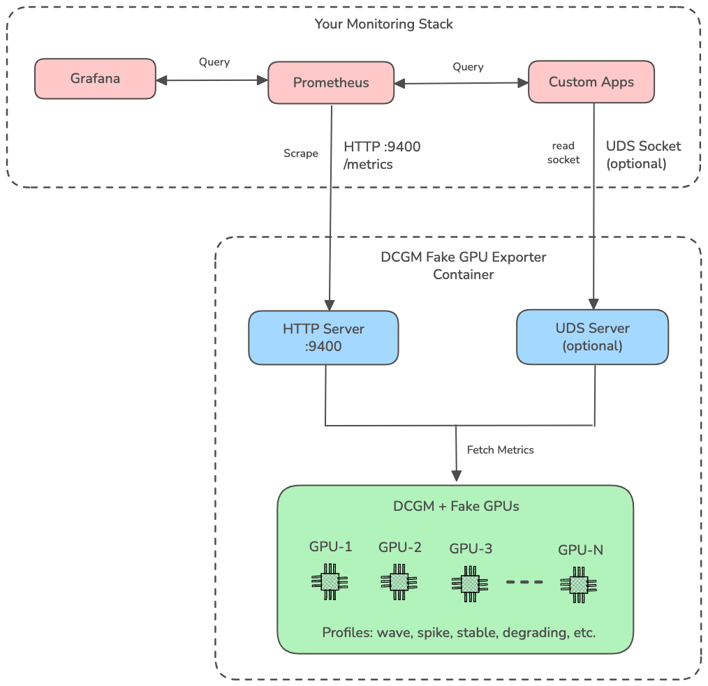
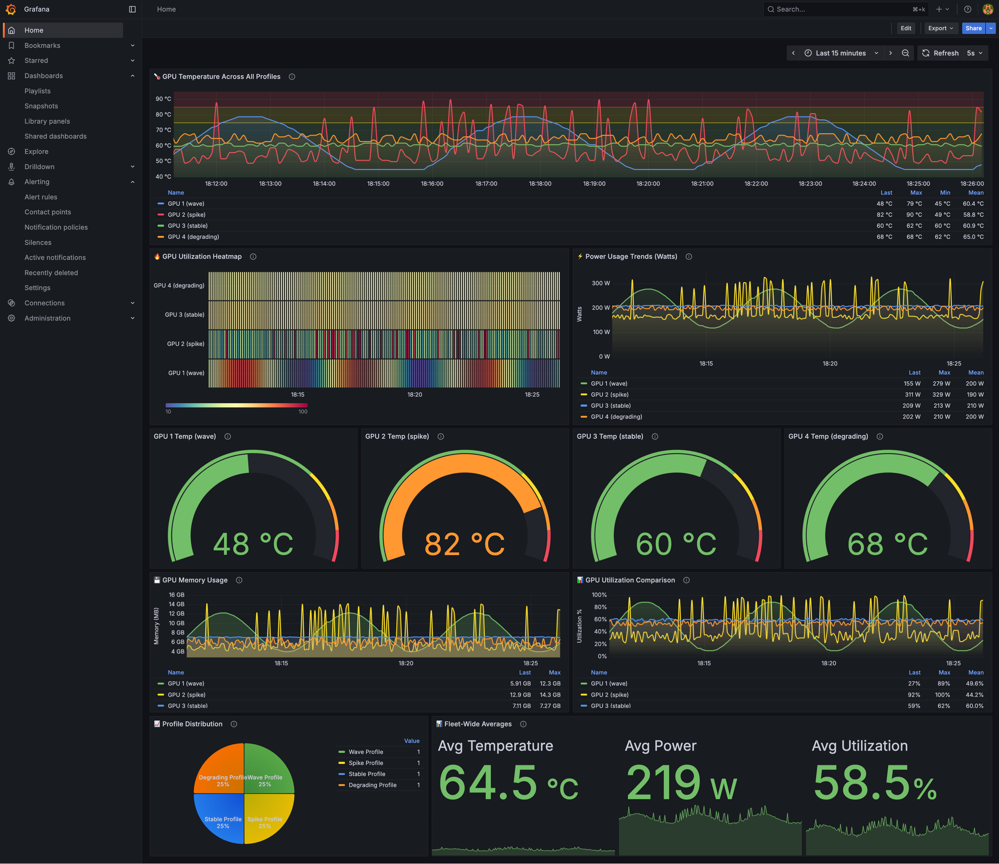

# DCGM Fake GPU Exporter

[](https://www.docker.com/)
[](https://opensource.org/licenses/MIT)
[](https://github.com/saiakhil2012/dcgm-fake-gpu-exporter/pkgs/container/dcgm-fake-gpu-exporter)

A powerful Prometheus exporter that simulates realistic NVIDIA GPU behavior using DCGM's injection framework. Test GPU monitoring, dashboards, and alerting systems **without expensive hardware** - from single GPUs to entire data center clusters.

---

## 🎯 Why This Tool?

- **💰 Save Costs**: No need for expensive GPU instances during development
- **🧪 Test at Scale**: Simulate 1 to 16 GPUs (DCGM limit) with realistic behavior
- **🎭 Realistic Scenarios**: 7 behavior profiles from stable workloads to chaos engineering
- **⚡ Quick Setup**: One command to get running - no 10+ hour DCGM builds
- **🔄 Production-Ready**: Compatible with real DCGM metrics for seamless migration

> **Perfect for**: Dashboard development, alerting system testing, chaos engineering, CI/CD pipelines, training, and demos

## ✨ Features

- 🎯 **No GPU Required** - Runs on any x86-64 Linux system (including VMs and ARM machines via Rosetta/QEMU)
- 📊 **Full DCGM Metrics** - Temperature, power, utilization, memory, clocks, PCIe, NVLink, encoder/decoder
- 🐳 **Docker-based** - One command to run
- 📈 **Prometheus Compatible** - Standard metrics format
- 🔧 **Configurable** - Customize number of GPUs and their behavior
- 🔄 **Dynamic Metrics** - Realistic varying values that update automatically
- 🎭 **Metric Profiles** - Simulate different GPU behaviors (stable, spike, degrading, faulty, chaos, wave)
- 📐 **Scalable** - Test with 1 to 1000+ GPUs
- 🎛️ **Per-GPU Control** - Different behavior profiles for each GPU

## 🏗️ High-Level Architecture



**Two Ways to Consume Metrics:**
- 🌐 **HTTP (Default)**: Standard Prometheus scraping on port 9400
- 🔌 **UDS (Optional)**: Unix Domain Socket for local, low-latency access

## 🚀 Quick Start

### Prerequisites

- Docker and Docker Compose
- x86-64 Linux host (or ARM Mac with Rosetta 2)

### 🎨 Visual Demo (Recommended)

**See the profiles in action with Grafana!**



*Live multi-profile dashboard showing 4 GPUs with different behavior profiles: wave, spike, stable, and degrading*

```bash
# Start full stack: DCGM Exporter + Prometheus + Grafana
cd deployments
docker-compose -f docker-compose-demo.yml up -d

# Wait 30 seconds, then open Grafana
open http://localhost:3000
# Login: admin/admin
```

**Features beautiful dashboards showing:**
- 4 GPUs with different profiles (wave, spike, stable, degrading)
- Real-time graphs updating every 5 seconds
- Gauges, time series, and heatmaps
- **8 pre-configured alert rules** (spike detection, high temp, degrading performance, etc.)
- Perfect for demos and presentations!

📖 **[See GRAFANA_DEMO.md](GRAFANA_DEMO.md) for detailed guide and screenshots**

---

## 📡 Consuming the Exporter (Main Use Case)

> **This is the primary use case** - consume GPU metrics from the exporter in your monitoring stack.

The exporter provides two interfaces for consuming metrics:

### 🌐 Option 1: HTTP/REST API (Default - Recommended)

**Standard Prometheus scraping** - Works everywhere, no special setup needed.

#### Basic Usage

```bash
# Start the exporter
docker run -d \
  --name dcgm-fake-gpu-exporter \
  -p 9400:9400 \
  -e NUM_FAKE_GPUS=4 \
  ghcr.io/saiakhil2012/dcgm-fake-gpu-exporter:latest

# Consume metrics via HTTP
curl http://localhost:9400/metrics
```

#### With Prometheus (docker-compose)

```yaml
# docker-compose.yml
services:
  dcgm-exporter:
    image: ghcr.io/saiakhil2012/dcgm-fake-gpu-exporter:latest
    ports:
      - "9400:9400"
    environment:
      - NUM_FAKE_GPUS=4
      - METRIC_PROFILE=stable
    restart: unless-stopped

  prometheus:
    image: prom/prometheus:latest
    ports:
      - "9090:9090"
    volumes:
      - ./prometheus.yml:/etc/prometheus/prometheus.yml
    command:
      - '--config.file=/etc/prometheus/prometheus.yml'
```

**prometheus.yml:**
```yaml
scrape_configs:
  - job_name: 'dcgm'
    static_configs:
      - targets: ['dcgm-exporter:9400']
    scrape_interval: 10s
```

#### With Python

```python
import requests

# Fetch metrics
response = requests.get('http://localhost:9400/metrics')
metrics = response.text

# Parse and use
for line in metrics.split('\n'):
    if 'dcgm_gpu_temp' in line and not line.startswith('#'):
        print(line)
```

#### With Grafana

```promql
# Query GPU temperatures
DCGM_FI_DEV_GPU_TEMP{gpu!="0"}

# GPU utilization
DCGM_FI_DEV_GPU_UTIL{gpu!="0"}

# Power usage
DCGM_FI_DEV_POWER_USAGE{gpu!="0"}
```

---

### 🔌 Option 2: Unix Domain Socket (Optional - Low Latency)

**For local, high-performance metric collection** - Lower latency, no network overhead.

#### Basic Usage

```bash
# Start exporter with UDS enabled
docker run -d \
  --name dcgm-fake-gpu-exporter \
  -p 9400:9400 \
  -v /tmp/dcgm-metrics:/var/run/dcgm \
  -e NUM_FAKE_GPUS=4 \
  -e ENABLE_UDS=true \
  ghcr.io/saiakhil2012/dcgm-fake-gpu-exporter:latest

# Consume via UDS (Python example)
import socket

sock = socket.socket(socket.AF_UNIX, socket.SOCK_STREAM)
sock.connect('/tmp/dcgm-metrics/metrics.sock')
sock.sendall(b'GET /metrics HTTP/1.1\r\nHost: localhost\r\n\r\n')
response = sock.recv(65536)
print(response.decode('utf-8'))
sock.close()
```

#### With docker-compose

```yaml
# docker-compose.yml
services:
  # Exporter with UDS enabled
  dcgm-exporter:
    image: ghcr.io/saiakhil2012/dcgm-fake-gpu-exporter:latest
    volumes:
      - /tmp/dcgm-metrics:/var/run/dcgm
    environment:
      - NUM_FAKE_GPUS=4
      - ENABLE_UDS=true  # 🔥 Enable UDS
    restart: unless-stopped

  # Your consumer application
  my-app:
    image: my-monitoring-app:latest
    volumes:
      - /tmp/dcgm-metrics:/var/run/dcgm  # Share socket
    environment:
      - DCGM_SOCKET=/var/run/dcgm/metrics.sock
```

#### With Go

```go
package main

import (
    "fmt"
    "net"
    "net/http"
)

func main() {
    // Connect to UDS
    conn, _ := net.Dial("unix", "/tmp/dcgm-metrics/metrics.sock")
    defer conn.Close()
    
    // Send HTTP request
    fmt.Fprintf(conn, "GET /metrics HTTP/1.1\r\nHost: localhost\r\n\r\n")
    
    // Read response
    buf := make([]byte, 65536)
    n, _ := conn.Read(buf)
    fmt.Println(string(buf[:n]))
}
```

**Benefits of UDS:**
- ⚡ Lower latency (no TCP/IP stack)
- 🔒 File system permissions (secure)
- 🚫 No port conflicts
- 📊 Works alongside HTTP (both enabled simultaneously)

📖 **[Complete UDS Guide](docs/UDS_SUPPORT.md)** - Configuration, examples, troubleshooting

---

## 🛠️ Building from Source (For Contributors)

> **Most users don't need to build** - use the pre-built image above. Build only if contributing or customizing.

### Pull Pre-Built Image

```bash
docker pull ghcr.io/saiakhil2012/dcgm-fake-gpu-exporter:latest

# Run it
docker run -d -p 9400:9400 \
  -e NUM_FAKE_GPUS=4 \
  ghcr.io/saiakhil2012/dcgm-fake-gpu-exporter:latest
```

### Build from Source

**ONE unified build script** with multiple build methods:

```bash
# Clone the repository
git clone https://github.com/saiakhil2012/dcgm-fake-gpu-exporter.git
cd dcgm-fake-gpu-exporter

# Auto-detect best build method (recommended)
./scripts/build.sh

# Or specify a method:
./scripts/build.sh optimized        # From tar file (recommended)
./scripts/build.sh from-image       # From existing Docker image
./scripts/build.sh from-binaries    # From DCGM binaries

# With custom tag:
./scripts/build.sh optimized -t v2.0

# Get help:
./scripts/build.sh --help
```

**Build Methods:**

| Method | When to Use | Requirements | Build Time |
|--------|-------------|--------------|------------|
| **auto** | Let the script decide (default) | Any source available | Varies |
| **from-image** | ⭐ Fastest dev iterations | Existing Docker image | ~30 sec |
| **optimized** | First-time or full rebuild | `artifacts/DCGM_subset.tar.gz` | ~2 min |
| **from-binaries** | Custom DCGM builds | DCGM binaries at `$DCGM_DIR` | ~3 min |

**Priority:** The auto-detect will use: existing image > tar file > binaries (fastest to slowest)

**After building:**
```bash
# Run the newly built image
docker run -d -p 9400:9400 dcgm-fake-gpu-exporter:latest

# Or with docker-compose
cd deployments && docker-compose up -d

# View metrics
curl http://localhost:9400/metrics
```

📚 **[See BUILDING_DCGM.md](docs/BUILDING_DCGM.md)** for obtaining DCGM binaries (if needed).

## 📊 Available Metrics

All metric names match the official DCGM field names from [NVIDIA DCGM API documentation](https://docs.nvidia.com/datacenter/dcgm/latest/dcgm-api/dcgm-api-field-ids.html).

| Metric | Field ID | Description | Unit |
|--------|----------|-------------|------|
| `DCGM_FI_DEV_GPU_TEMP` | 150 | GPU temperature | Celsius |
| `DCGM_FI_DEV_POWER_USAGE` | 155 | Power consumption | Watts |
| `DCGM_FI_DEV_GPU_UTIL` | 203 | GPU utilization | percentage |
| `DCGM_FI_DEV_MEM_COPY_UTIL` | 204 | Memory utilization | percentage |
| `DCGM_FI_DEV_SM_CLOCK` | 100 | SM clock speed | MHz |
| `DCGM_FI_DEV_MEM_CLOCK` | 101 | Memory clock speed | MHz |
| `DCGM_FI_DEV_FB_TOTAL` | 250 | Total framebuffer | MB |
| `DCGM_FI_DEV_FB_FREE` | 251 | Free framebuffer | MB |
| `DCGM_FI_DEV_FB_USED` | 252 | Used framebuffer | MB |

### Metric Labels

All metrics include the following labels (matching real DCGM exporter format):

| Label | Description | Example |
|-------|-------------|---------|
| `gpu` | GPU ID | `"1"`, `"2"`, `"3"` |
| `device` | Device name | `"nvidia1"`, `"nvidia2"` |
| `Hostname` | Container/host hostname | `"dcgm-fake-gpu-exporter"` |
| `UUID` | GPU UUID | `"GPU-00000001-fake-dcgm-0001-000400000001"` |
| `modelName` | GPU model name | `"Tesla V100-SXM2-16GB"`, `"A100-SXM4-40GB"` |
| `pci_bus_id` | PCI bus ID | `"00000000:01:00.0"`, `"00000000:02:00.0"` |

**Example metric output:**
```
DCGM_FI_DEV_GPU_TEMP{gpu="1",device="nvidia1",Hostname="dcgm-exporter",UUID="GPU-00000001-fake-dcgm-0001-000400000001",modelName="Tesla V100-SXM2-16GB",pci_bus_id="00000000:01:00.0"} 55.0
```

## 🔧 Configuration

### Environment Variables

| Variable | Default | Description |
|----------|---------|-------------|
| `NUM_FAKE_GPUS` | `4` | Number of fake GPUs to create (1-16, DCGM limit) |
| `METRIC_PROFILE` | `static` | Metric behavior profile (see profiles below) |
| `GPU_PROFILES` | - | Comma-separated profiles per GPU (overrides METRIC_PROFILE) |
| `METRIC_UPDATE_INTERVAL` | `30` | Seconds between metric updates |
| `GPU_START_INDEX` | `1` | Starting GPU index (for cluster simulation) |
| `EXPORTER_PORT` | `9400` | Prometheus metrics port |
| `HOSTNAME_OVERRIDE` | - | Override hostname in metrics (useful in Kubernetes) |
| `NODE_NAME` | - | Node name for Kubernetes (fallback if HOSTNAME_OVERRIDE not set) |
| `ENABLE_UDS` | `false` | Enable Unix Domain Socket server (`true`/`false`) |
| `UDS_SOCKET_PATH` | `/var/run/dcgm/metrics.sock` | Path to UDS socket (inside container) |
| `DCGM_DIR` | `/root/Workspace/DCGM/_out/Linux-amd64-debug` | Path to DCGM binaries in container |

### Metric Profiles

Simulate different GPU behaviors for testing dashboards and alerting:

| Profile | Description | Use Case |
|---------|-------------|----------|
| `static` | Fixed random values (backward compatible) | Existing setups, predictable metrics |
| `stable` | Minimal variation, steady state | Production-like steady workloads |
| `spike` | Random sudden spikes (20% chance) | Testing spike detection, auto-scaling |
| `wave` | Sine wave patterns | Batch jobs, cyclical workloads |
| `degrading` | Gradual performance decline | Hardware aging, thermal throttling |
| `faulty` | Intermittent failures (10% chance) | Fault detection, alerting systems |
| `chaos` | Completely random values | Stress testing, chaos engineering |

📚 **[See full profile documentation](docs/PROFILES.md)** for detailed behavior, use cases, and examples.

### Example Configurations

**8 GPUs with spike profile:**
```bash
docker run -d -p 9400:9400 \
  -e NUM_FAKE_GPUS=8 \
  -e METRIC_PROFILE=spike \
  dcgm-fake-gpu-exporter
```

**Per-GPU profiles (mixed behavior):**
```bash
docker run -d -p 9400:9400 \
  -e NUM_FAKE_GPUS=4 \
  -e GPU_PROFILES=stable,spike,faulty,degrading \
  dcgm-fake-gpu-exporter
```

**Large-scale testing (16 GPUs - DCGM max):**
```bash
docker run -d -p 9400:9400 \
  -e NUM_FAKE_GPUS=16 \
  -e METRIC_PROFILE=wave \
  dcgm-fake-gpu-exporter
```

**Fast updates for testing:**
```bash
docker run -d -p 9400:9400 \
  -e METRIC_UPDATE_INTERVAL=3 \
  -e METRIC_PROFILE=wave \
  dcgm-fake-gpu-exporter
```

**Demo mode (visible changes every 2 seconds):**
```bash
docker run -d -p 9400:9400 \
  -e NUM_FAKE_GPUS=4 \
  -e METRIC_PROFILE=wave \
  -e METRIC_UPDATE_INTERVAL=2 \
  dcgm-fake-gpu-exporter

# Watch it change in real-time
watch -n 2 'curl -s http://localhost:9400/metrics | grep dcgm_gpu_temp'
```

**Cluster simulation (multiple containers for >16 GPUs):**
```bash
# Container 1: GPUs 1-16
docker run -d -p 9401:9400 \
  -e NUM_FAKE_GPUS=16 \
  -e GPU_START_INDEX=1 \
  dcgm-fake-gpu-exporter

# Container 2: GPUs 17-32
docker run -d -p 9402:9400 \
  -e NUM_FAKE_GPUS=16 \
  -e GPU_START_INDEX=17 \
  dcgm-fake-gpu-exporter

# This way you can simulate 100+ GPUs across multiple containers
```

**Custom port:**
```bash
docker run -d -p 9401:9400 dcgm-fake-gpu-exporter
```

**Kubernetes deployment with proper hostname:**
```yaml
apiVersion: apps/v1
kind: Deployment
metadata:
  name: dcgm-fake-exporter
spec:
  replicas: 1
  template:
    spec:
      containers:
      - name: exporter
        image: ghcr.io/zhaodong-arista/dcgm-fake-gpu-exporter:latest
        env:
        - name: NUM_FAKE_GPUS
          value: "4"
        - name: NODE_NAME
          valueFrom:
            fieldRef:
              fieldPath: spec.nodeName
        - name: HOSTNAME_OVERRIDE
          value: "$(NODE_NAME)"  # Use node name instead of pod name
        ports:
        - containerPort: 9400
          name: metrics
```

## 📈 Integration Examples

### Consuming Metrics via HTTP (Default)

```bash
# Prometheus
curl http://localhost:9400/metrics

# Python
import requests
metrics = requests.get('http://localhost:9400/metrics').text
```

### Consuming Metrics via Unix Domain Socket (Built-in!)

**Native UDS support** - no extra containers needed! Just set `ENABLE_UDS=true`:

```yaml
services:
  dcgm-exporter:
    image: ghcr.io/saiakhil2012/dcgm-fake-gpu-exporter:latest
    volumes:
      - /tmp/dcgm-metrics:/var/run/dcgm
    environment:
      - NUM_FAKE_GPUS=4
      - ENABLE_UDS=true  # 🔥 Enable UDS support
```

**Consumer reads from UDS:**
```python
import socket

sock = socket.socket(socket.AF_UNIX, socket.SOCK_STREAM)
sock.connect('/tmp/dcgm-metrics/metrics.sock')
sock.sendall(b'GET /metrics HTTP/1.1\r\nHost: localhost\r\n\r\n')
response = sock.recv(65536)
print(response.decode('utf-8'))
```

✅ **Works on macOS M2, Linux, and Ubuntu!**  
✅ **No extra containers** - UDS built into the exporter  
✅ **Zero friction** for consumers

📖 **[Complete UDS guide](docs/UDS_SUPPORT.md)** - Configuration, examples, troubleshooting

---

### Prometheus

Add to your `prometheus.yml`:

```yaml
scrape_configs:
  - job_name: 'dcgm'
    static_configs:
      - targets: ['localhost:9400']
    scrape_interval: 10s
```

Or use the included docker-compose with Prometheus:

```bash
cd deployments
docker-compose --profile with-prometheus up -d
```

Then access Prometheus at `http://localhost:9090`

### OpenTelemetry Collector

```yaml
receivers:
  prometheus:
    config:
      scrape_configs:
        - job_name: 'dcgm'
          static_configs:
            - targets: ['localhost:9400']

exporters:
  otlp:
    endpoint: your-otel-collector:4317

service:
  pipelines:
    metrics:
      receivers: [prometheus]
      exporters: [otlp]
```

### Grafana

Sample metrics queries:

```promql
# GPU Temperature
dcgm_gpu_temp{gpu!="0"}

# GPU Utilization
dcgm_gpu_utilization{gpu!="0"}

# Power Usage (convert from milliwatts to watts)
dcgm_power_usage{gpu!="0"} / 1000

# Memory Usage Percentage
(dcgm_fb_used / dcgm_fb_total) * 100
```

## 🏗️ Architecture

### System Overview

```
╔════════════════════════════════════════════════════════════════════════════╗
║                    DCGM Fake GPU Exporter - System Architecture            ║
╚════════════════════════════════════════════════════════════════════════════╝

                              ┌─────────────┐
                              │   Users     │
                              │  Operators  │
                              └──────┬──────┘
                                     │
                        ┌────────────┴────────────┐
                        │                         │
                   ┌────▼────┐              ┌────▼────┐
                   │ Grafana │              │ Custom  │
                   │  :3000  │              │  Apps   │
                   └────┬────┘              └────┬────┘
                        │                         │
                        │    ┌────────────┐       │
                        └───▶│ Prometheus │◀──────┘
                             │   :9090    │
                             └─────┬──────┘
                                   │ Scrape /metrics
╔══════════════════════════════════▼═══════════════════════════════════════╗
║                    DCGM Fake GPU Exporter Container                      ║
║                                                                          ║
║  ┌────────────────────────────────────────────────────────────────┐    ║
║  │                      Exporter Layer                            │    ║
║  │  ┌─────────────┐  ┌─────────────┐  ┌──────────────────────┐  │    ║
║  │  │HTTP Server  │  │ UDS Server  │  │  Metrics Formatter   │  │    ║
║  │  │  :9400      │  │  (optional) │  │  (Prometheus)        │  │    ║
║  │  └──────┬──────┘  └──────┬──────┘  └──────────┬───────────┘  │    ║
║  └─────────┼───────────────┼──────────────────────┼──────────────┘    ║
║            └───────────────┴──────────────────────┘                    ║
║  ┌─────────────────────────────────────────────────────────────────┐  ║
║  │                   DCGM Manager Layer                            │  ║
║  │  • Creates fake GPUs (1-16)                                     │  ║
║  │  • Assigns metric profiles                                      │  ║
║  │  • Updates metrics every 30s                                    │  ║
║  └───────────────────────────┬─────────────────────────────────────┘  ║
║                              │                                         ║
║  ┌───────────────────────────▼─────────────────────────────────────┐  ║
║  │              DCGM Core (nv-hostengine)                          │  ║
║  │  • Manages GPU metrics database                                 │  ║
║  │  • Provides DCGM API                                            │  ║
║  └───────────────────────────┬─────────────────────────────────────┘  ║
║                              │                                         ║
║  ┌───────────────────────────▼─────────────────────────────────────┐  ║
║  │         NVML Injection Layer (libnvml_injection.so)             │  ║
║  │  • Intercepts NVML API calls                                    │  ║
║  │  • Returns fake GPU data                                        │  ║
║  └───────────────────────────┬─────────────────────────────────────┘  ║
║                              │                                         ║
║  ┌───────────────────────────▼─────────────────────────────────────┐  ║
║  │                    Fake GPU Layer                               │  ║
║  │  ╔═══╗  ╔═══╗  ╔═══╗  ╔═══╗  ╔═══╗  ╔═══╗  ╔═══╗  ╔═══╗        │  ║
║  │  ║ 1 ║  ║ 2 ║  ║ 3 ║  ║ 4 ║  ║ 5 ║  ║ 6 ║  ║...║  ║16 ║        │  ║
║  │  ╚═══╝  ╚═══╝  ╚═══╝  ╚═══╝  ╚═══╝  ╚═══╝  ╚═══╝  ╚═══╝        │  ║
║  │                                                                  │  ║
║  │  Profiles: static │ stable │ spike │ wave │ degrading │         │  ║
║  │            faulty │ chaos                                       │  ║
║  └──────────────────────────────────────────────────────────────────┘  ║
╚══════════════════════════════════════════════════════════════════════════╝
```

### Key Components

1. **HTTP Server** (`dcgm_exporter.py`)
   - Exposes metrics on port 9400
   - `/metrics` endpoint (Prometheus format)
   - `/health` endpoint (health check)

2. **UDS Server** (`dcgm_uds_server.py`) - *Optional*
   - Unix Domain Socket interface
   - Lower latency than HTTP
   - Enable with `ENABLE_UDS=true`

3. **DCGM Manager** (`dcgm_fake_manager.py`)
   - Creates and manages fake GPUs
   - Injects GPU attributes and metrics
   - Background updater thread (30s intervals)

4. **DCGM Core** (`nv-hostengine`)
   - NVIDIA's DCGM daemon
   - Manages GPU metrics database
   - Provides DCGM API on port 5555

5. **NVML Injection** (`libnvml_injection.so`)
   - Simulates NVIDIA GPU hardware
   - No real GPU required
   - Injected via `LD_PRELOAD`

6. **Fake GPUs**
   - Up to 16 GPUs per container
   - Each with configurable behavior profile
   - Realistic metric patterns

📖 **[See detailed architecture documentation](docs/ARCHITECTURE.md)** for complete diagrams, data flow, deployment architecture, and technical details.

## 🔨 Building DCGM Binaries (Optional)

> ⚠️ **Warning**: Building DCGM from source takes 10-15 hours and requires significant resources.

If you want to build DCGM yourself:

```bash
# On Ubuntu 22.04 x86-64 system
git clone https://github.com/NVIDIA/DCGM.git
cd DCGM

# Build (this will take ~10 hours)
make -j$(nproc)

# The binaries will be in:
# ./_out/Linux-amd64-debug/
```

Once built, set the path:

```bash
export DCGM_DIR="$HOME/Workspace/DCGM/_out/Linux-amd64-debug"
./scripts/build.sh
```

## 🎯 Use Cases

- **Development**: Test GPU monitoring dashboards without hardware
- **CI/CD**: Validate GPU-aware applications in pipelines
- **Demos**: Show GPU metrics visualizations without real GPUs
- **Testing**: Test Prometheus/Grafana/OTEL setups for GPU monitoring
- **Training**: Learn DCGM, GPU metrics, and observability tools
- **Cost Savings**: Avoid spinning up expensive GPU instances for development
- **Alerting**: Test alert rules with different GPU behavior patterns
- **Chaos Engineering**: Simulate GPU failures and degradation
- **Load Testing**: Test monitoring systems with 100+ GPUs (using multiple containers)
- **Dashboard Development**: Build and iterate on Grafana dashboards quickly

## 🚀 Migration to Production

When you're ready to move from fake GPUs to real hardware:

### Step 1: Replace the Exporter

```yaml
# docker-compose.yml - Development (Fake GPUs)
services:
  dcgm-exporter:
    image: your-registry/dcgm-fake-gpu-exporter
    ports:
      - "9400:9400"
    environment:
      - NUM_FAKE_GPUS=4
      - METRIC_PROFILE=stable
```

```yaml
# docker-compose.yml - Production (Real GPUs)
services:
  dcgm-exporter:
    image: nvcr.io/nvidia/k8s/dcgm-exporter:latest
    runtime: nvidia
    environment:
      - NVIDIA_VISIBLE_DEVICES=all
    ports:
      - "9400:9400"
    cap_add:
      - SYS_ADMIN
```

### Step 2: Keep Your Monitoring Stack

✅ **No changes needed** to:
- Prometheus scrape configs
- Grafana dashboards
- Alert rules
- Metric names and labels

The metrics are compatible between fake and real exporters!

### Step 3: Update Queries (Optional)

If you filtered out GPU 0 in fake mode, you can remove that filter:

```promql
# Fake GPU queries (filter GPU 0)
dcgm_gpu_temp{gpu!="0"}

# Real GPU queries (all GPUs valid)
dcgm_gpu_temp
```

## 🐛 Troubleshooting

### Container keeps restarting

```bash
docker logs dcgm-exporter
```

Check if nv-hostengine is starting properly. Common issues:
- Missing DCGM binaries
- Incorrect file permissions
- Port 5555 already in use

### No metrics showing

```bash
# Check health endpoint
curl http://localhost:9400/health

# Exec into container
docker exec -it dcgm-exporter bash

# Check DCGM directly
/usr/local/bin/dcgm_fake_manager.py status

# View metrics manually
/root/Workspace/DCGM/_out/Linux-amd64-debug/share/dcgm_tests/apps/amd64/dcgmi dmon -e 150,155,203,204
```

### GPU 0 shows zeros

This is expected behavior. GPU 0 is an artifact of NVML injection and can be filtered out:

```promql
# In Prometheus queries
DCGM_FI_DEV_GPU_TEMP{gpu!="0"}
```

### Port already in use

```bash
# Use different port
docker run -p 9401:9400 -e EXPORTER_PORT=9400 dcgm-fake-gpu-exporter
```

### Running on ARM Mac (M1/M2/M3)

✅ **Works natively via Docker Desktop's Rosetta 2 emulation!** No special flags needed:

```bash
# Same command as x86-64 - Docker handles emulation automatically
docker run -d -p 9400:9400 \
  -e NUM_FAKE_GPUS=4 \
  -e METRIC_PROFILE=wave \
  ghcr.io/saiakhil2012/dcgm-fake-gpu-exporter:latest
```

Perfect for development and testing on Apple Silicon without needing a separate Linux VM.

## 🧪 Testing

### Quick Test

```bash
# Start container
cd deployments
docker-compose up -d

# Wait for startup (15 seconds)
sleep 15

# Check metrics
curl -s http://localhost:9400/metrics | grep DCGM_FI_DEV_GPU_TEMP

# Should see output like:
# DCGM_FI_DEV_GPU_TEMP{gpu="1",device="nvidia1",Hostname="...",UUID="...",modelName="Tesla V100-SXM2-16GB",pci_bus_id="00000000:01:00.0"} 51
# DCGM_FI_DEV_GPU_TEMP{gpu="2",device="nvidia2",Hostname="...",UUID="...",modelName="Tesla V100-SXM2-32GB",pci_bus_id="00000000:02:00.0"} 58
# DCGM_FI_DEV_GPU_TEMP{gpu="3",device="nvidia3",Hostname="...",UUID="...",modelName="A100-SXM4-40GB",pci_bus_id="00000000:03:00.0"} 65
# DCGM_FI_DEV_GPU_TEMP{gpu="4",device="nvidia4",Hostname="...",UUID="...",modelName="A100-SXM4-80GB",pci_bus_id="00000000:04:00.0"} 73
```

### Testing Different Profiles

```bash
# Test spike profile
docker run -d -p 9400:9400 -e METRIC_PROFILE=spike dcgm-fake-gpu-exporter
watch -n 5 'curl -s http://localhost:9400/metrics | grep dcgm_gpu_temp'

# Test wave profile
docker run -d -p 9400:9400 -e METRIC_PROFILE=wave dcgm-fake-gpu-exporter

# Test with 100 GPUs
```bash
# Test with 100 GPUs
docker run -d -p 9400:9400 -e NUM_FAKE_GPUS=100 -e METRIC_PROFILE=stable dcgm-fake-gpu-exporter
```

**Note**: NUM_FAKE_GPUS values >16 will be automatically capped to 16. To test with more GPUs, run multiple containers with different `GPU_START_INDEX` values (see cluster simulation example above).
```

### With Prometheus

```bash
# Start with Prometheus
cd deployments
docker-compose --profile with-prometheus up -d

# Wait for startup
sleep 20

# Open Prometheus UI
open http://localhost:9090

# Try a query:
dcgm_gpu_temp{gpu!="0"}
```

### Testing Multiple Profiles

Use the examples docker-compose:

```bash
# Test all profiles at once
cd examples
docker-compose -f docker-compose.profiles.yml up -d

# Each profile on different port:
# Stable:  http://localhost:9400/metrics
# Spike:   http://localhost:9401/metrics (with --profile spike)
# Mixed:   http://localhost:9402/metrics (with --profile mixed)
# Scale:   http://localhost:9403/metrics (with --profile scale)
# Chaos:   http://localhost:9404/metrics (with --profile chaos)
```

## ⚠️ Limitations

- **GPU Count**: Maximum 16 fake GPUs per container (DCGM limitation) - use multiple containers for more
- **GPU Names/UUIDs**: Show as `<<<NULL>>>` due to DCGM fake entity limitations
- **GPU 0**: Shows zeros (NVML injection artifact) - filter it out in queries
- **Platform**: Linux x86-64 only (DCGM limitation)
- **Metrics**: Simulated values, not real GPU measurements
- **Performance**: Not suitable for performance testing, only monitoring/observability testing

## 📁 Repository Structure

```
.
├── README.md                        # This file
├── LICENSE                          # MIT License
├── CONTRIBUTING.md                  # Contribution guidelines
├── SECURITY.md                      # Security policy
├── Makefile                         # Convenience commands
│
├── src/                             # Source code
│   ├── dcgm_exporter.py            # HTTP metrics exporter
│   ├── dcgm_fake_manager.py        # Fake GPU manager
│   ├── dcgm_uds_server.py          # Unix Domain Socket server
│   └── docker-entrypoint.sh        # Container entrypoint
│
├── docker/                          # Dockerfiles
│   ├── Dockerfile                  # Default (symlink to optimized)
│   ├── Dockerfile.from-binaries-optimized  # Recommended build
│   ├── Dockerfile.from-binaries    # Legacy from binaries
│   ├── Dockerfile.from-image       # Build from existing image
│   └── README.md                   # Dockerfile documentation
│
├── scripts/                         # Build scripts
│   ├── build.sh                    # Unified build script (auto/optimized/from-binaries/from-image)
│   └── README.md                   # Build documentation
│
├── tests/                           # Test scripts
│   ├── test-uds.sh                 # UDS connectivity test
│   ├── test-wave-updates.sh        # Wave profile test
│   └── README.md                   # Testing documentation
│
├── deployments/                     # Docker Compose files
│   ├── docker-compose.yml          # Basic deployment
│   ├── docker-compose-demo.yml     # Full stack demo (Prometheus + Grafana)
│   ├── prometheus.yml              # Prometheus config
│   ├── examples/                   # Example configs
│   ├── grafana/                    # Grafana provisioning
│   └── README.md                   # Deployment guide
│
├── artifacts/                       # Binary artifacts (gitignored)
│   ├── DCGM_subset.tar.gz          # DCGM binaries (not in git)
│   ├── .gitkeep                    # Keep directory
│   └── README.md                   # How to obtain artifacts
│
├── docs/                            # Documentation
│   ├── ARCHITECTURE.md             # Architecture diagrams
│   ├── QUICKSTART.md               # Quick start guide
│   ├── DEPLOYMENT.md               # Deployment guide
│   ├── BUILDING_DCGM.md            # DCGM build instructions
│   ├── GITHUB_SETUP.md             # GitHub setup
│   └── images/                     # Documentation images
│
├── grafana/                         # Grafana dashboards
│   ├── dashboards/
│   │   └── default-dashboard.json
│   └── provisioning/
│       ├── dashboards/
│       └── datasources/
│
├── examples/                        # Example configurations
│   ├── docker-compose.otel.yml     # OpenTelemetry setup
│   ├── grafana-dashboard.json      # Sample dashboard
│   ├── otel-collector-config.yaml  # OTEL config
│   └── prometheus.yml              # Prometheus config
│
├── utility/                         # Utility scripts
│   └── extract-dcgm.sh             # Extract DCGM from image
│
└── internal/                        # Internal docs (gitignored)
    ├── ARCHITECTURE_DIAGRAMS.md    # All ASCII diagrams
    ├── REPO_REORGANIZATION_PLAN.md # Reorganization plan
    ├── PHASE1_COMPLETE.md          # Phase 1 summary
    └── *.md                        # Work-in-progress docs
```

**Directory Organization:**

- **Root**: Only essential files (README, LICENSE, Makefile)
- **`src/`**: All Python source code and entrypoint
- **`docker/`**: All Dockerfile variants
- **`scripts/`**: Build and utility scripts
- **`tests/`**: Test scripts for validation
- **`deployments/`**: Docker Compose configurations
- **`artifacts/`**: Binary files (DCGM), gitignored
- **`docs/`**: Public-facing documentation
- **`grafana/`**: Grafana provisioning and dashboards
- **`examples/`**: Example configurations
- **`internal/`**: Work-in-progress docs, gitignored

📖 **Each directory has its own README** with detailed information about contents and usage.

---

## 📚 Documentation

Comprehensive guides for all aspects of the project:

### Getting Started
- **[Quick Start](docs/QUICKSTART.md)** - Get up and running in 5 minutes
- **[Deployment Guide](docs/DEPLOYMENT.md)** - Production deployment strategies
- **[Build Instructions](scripts/README.md)** - How to build from source

### Architecture & Design
- **[Architecture Overview](docs/ARCHITECTURE.md)** - System architecture, components, data flow
- **[UDS Support](docs/UDS_SUPPORT.md)** - Unix Domain Socket integration
- **[Source Code](src/README.md)** - Code structure and metric profiles

### Advanced Topics
- **[Building DCGM](docs/BUILDING_DCGM.md)** - Build DCGM from source (optional)
- **[GitHub Setup](docs/GITHUB_SETUP.md)** - Repository and CI/CD setup
- **[Contributing](CONTRIBUTING.md)** - How to contribute to this project

### Reference
- **[Dockerfile Variants](docker/README.md)** - All Dockerfile options explained
- **[Testing Guide](tests/README.md)** - Test scripts and validation
- **[Deployment Configurations](deployments/README.md)** - All docker-compose variants

💡 **New to the project?** Start with [Quick Start](docs/QUICKSTART.md) → [Architecture](docs/ARCHITECTURE.md) → [Deployment Guide](docs/DEPLOYMENT.md)

## 🤝 Contributing

Contributions welcome! Please:

1. Fork the repository
2. Create a feature branch
3. Make your changes
4. Test thoroughly
5. Submit a pull request

## License

- **This project**: MIT License
- **DCGM binaries** (included in Docker image): Apache 2.0 License
  - Source: https://github.com/NVIDIA/DCGM
  - Copyright: NVIDIA CORPORATION

See [LICENSE](LICENSE) file for details.

## 🙏 Acknowledgments

- Built using [NVIDIA DCGM](https://github.com/NVIDIA/DCGM)'s injection framework
- Inspired by [NVIDIA DCGM Exporter](https://github.com/NVIDIA/dcgm-exporter)
- Created to avoid the 20+ hour DCGM build process

## 📮 Support

- **Issues**: [GitHub Issues](https://github.com/saiakhil2012/dcgm-fake-gpu-exporter/issues)
- **Discussions**: [GitHub Discussions](https://github.com/saiakhil2012/dcgm-fake-gpu-exporter/discussions)

---

**Note**: This is a development/testing tool. For production GPU monitoring with real hardware, use the official [NVIDIA DCGM Exporter](https://github.com/NVIDIA/dcgm-exporter).
